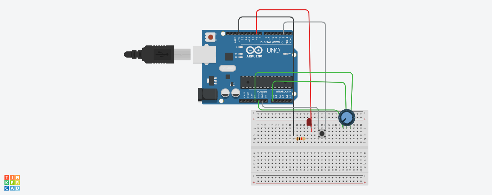

# Arduino Adaptive LED Control

This project demonstrates **adaptive (non-linear) LED brightness control** using a potentiometer and Arduino. The system adjusts LED brightness based on different input ranges, creating dynamic lighting behavior.

---

## 🔧 Features

- Button-controlled activation
- Potentiometer-based brightness control
- Non-linear (piecewise) brightness mapping
- Real-time value monitoring via Serial Monitor

---

## ⚙️ Components Used

- Arduino Uno
- LED
- Potentiometer
- Push Button
- Resistors
- Breadboard & Jumper Wires

---

## 🧠 Working Logic

- When the button is pressed:
  - The potentiometer value (0–1023) is read
  - Different brightness behaviors are applied:

| Range (Pot Value) | Behavior |
|------------------|---------|
| 0 – 350          | Normal brightness increase |
| 351 – 511        | Slower brightness increase |
| 512 – 1023       | Reverse brightness (fading effect) |

- When the button is not pressed:
  - LED remains OFF

---

## 🚀 How to Run

1. Connect the circuit as shown in the diagram
2. Upload the `.ino` file using Arduino IDE
3. Open Serial Monitor (9600 baud)
4. Press the button and rotate the potentiometer
5. Observe changing LED brightness

---

## 📸 Circuit Diagram

---

## 📂 Project Structure
arduino-adaptive-led-control/
│── led_control.ino
│── README.md
│── circuit.png

---

## 📌 Concepts Covered

- Analog Input (`analogRead`)
- PWM Output (`analogWrite`)
- Conditional Logic (if-else)
- Non-linear / Piecewise Mapping
- Embedded Systems Basics

---

## 🧪 Simulation

This project was designed and tested using Tinkercad Circuits before being implemented on real hardware.

## 🔮 Future Improvements

- Smooth fading transitions
- Sensor-based automation (temperature/light)
- Motor speed control using the same concept

---

Built as part of my Embedded Systems & Robotics learning journey 🚀
